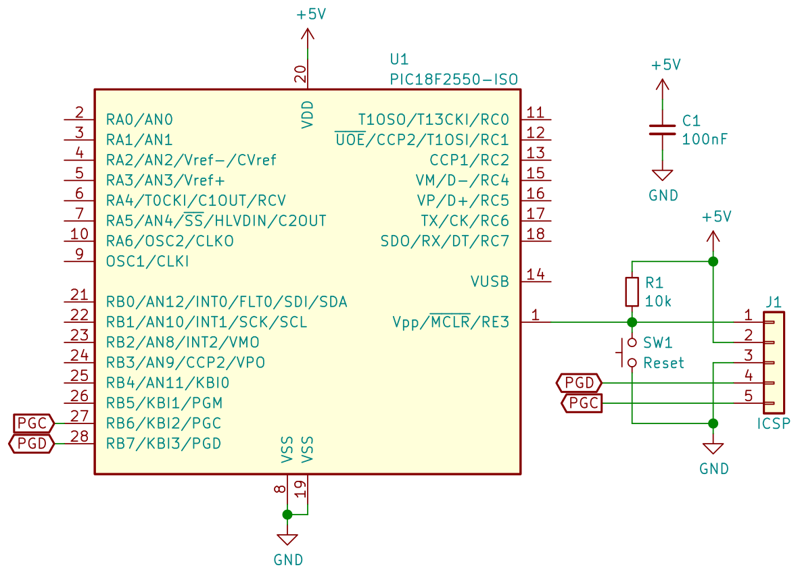

# PIC18F2550 Examples

This repository aims to provide some basic firmware examples for Microchip
PIC18F2550, based on XC8 Compiler. That's because, unfortunately, MPLAB Code
Configurator doesn't support this chip.

The included examples are also compatible with PIC18F2455, PIC18F4455 and
PIC18F4550, since it's the same datasheet.

## Requirements

- [MPLAB X IDE]
- [MPLAB XC8 Compiler]
- PIC18F2550 circuit
- PIC programmer (PICkit2, K150...)

## Available examples

- `blink`: toggles pin RB7 every 1 second
- `print`: support library for printing strings, ints and floats
- `serial/serial_basic.c`: prints numbers and strings to Serial and then echoes
    data back

## Base circuit

Below is the base 18F2550 circuit, where the PIC is programmed through an ICSP
connection.

There's no external crystal because the PIC already has a 8 MHz internal
oscillator block. A capacitor in Vusb, very common in many 18F2550 circuits, is
not needed unless it's working as a USB device, since Vusb is only used in the
USB transceiver (as stated in datasheet's section 17.2.2.8).

You could simplify this circuit even further by removing R1 and SW1, and
configuring RE3 as an input pin by setting `MCLRE = OFF` in `config.h`. By
doing this you would lose the reset function.

## Compiling the code

Since MPLAB X IDE generates the project files based on your machine
configuration and binaries location, you must manually create a new project,
download the code files to the project folder, and add them to the project.

The following instructions are based on MPLAB X IDE v5.45:

1. Inside MPLAB X IDE, go to File menu > New Project...;
2. Select "Microchip Embedded" in Categories, and "Standalone Project" in
    Projects;
3. Select "PIC18F2550" as Device, and "No Tool" in Tool;
4. Select "XC8 (v_.__)" as Compiler;
5. Set your project name and location, and select "UTF-8" as Encoding;
6. Download `config.h` and the example source code to the project folder;
7. In the Projects window (Window menu > Projects), right-click on "Header
    Files" and select "Add Existing Item..."
8. Select `config.h`, setting "Relative" in "Store path as";
9. In the Projects window again, right-click on "Source Files", select "Add
    Existing Item...", and add the main source code file;
10. In the Production menu, select "Build Project";
11. Your firmware file (`.hex`) should be located in your project folder,
    inside `dist/default/production` (it should be something like
    `<project name>.X.production.hex`).

### Configuration file

Unless stated in the example's README, the file `config.h` contains the
configuration bits for all the examples in this repository, and must be
included in your project.

## Resources

- [PIC18F2550 datasheet]
- [XC8 C Compiler User's Guide] - describes language features, library
    functions etc.
- 18F2550 Support Information - contains all available configuration bits and
    their values. It's located in XC8's install dir (somewhere like
    `C:/Program Files/Microchip/xc8/v2.32/docs/chips/18f2550.html`)

[MPLAB X IDE]: <https://www.microchip.com/en-us/development-tools-tools-and-software/mplab-x-ide>
[MPLAB XC8 Compiler]: <https://www.microchip.com/en-us/development-tools-tools-and-software/mplab-xc-compilers>
[PIC18F2550 datasheet]: <http://ww1.microchip.com/downloads/en/DeviceDoc/39632b.pdf>
[XC8 C Compiler User's Guide]: <http://ww1.microchip.com/downloads/en/DeviceDoc/50002053G.pdf>
